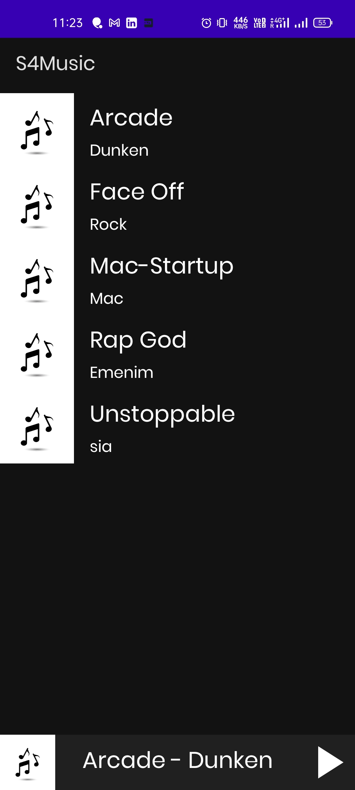
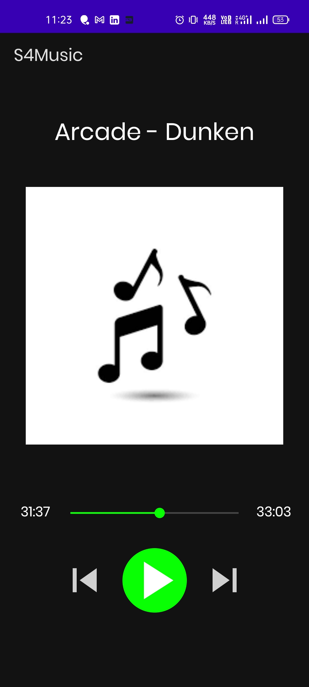
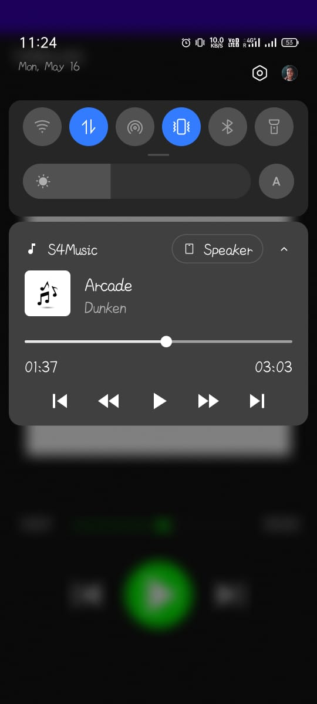
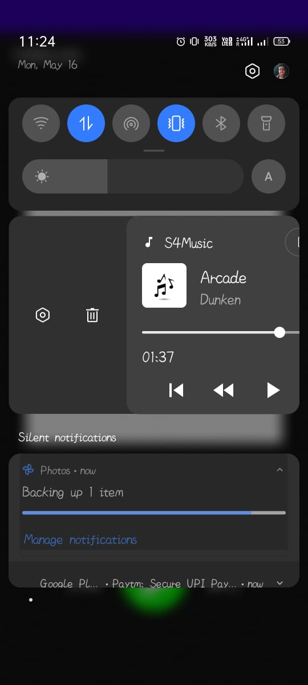

# Spotify Like app which has backend made in Firebase to fetch the song

## Output

  
  
   
   
   
  

  
  

## Steps to run this app

- Go to firebase
- Make an app
- Go to the storage upload the song and respective images
- Go to the firebase Database
- Database name should be song
- Every song name should be named test_song1, test_song2 and so On
- Make the database with id like

  - mediaId
  - songUrl
  - imageUrl
  - subtitle
  - title

- Make sure that the id matches to the respective column
- Download the google-services.json and put it in the app directory

> Make sure to run the app in Android Studio and connect the app to the firebase using Android Studio.
